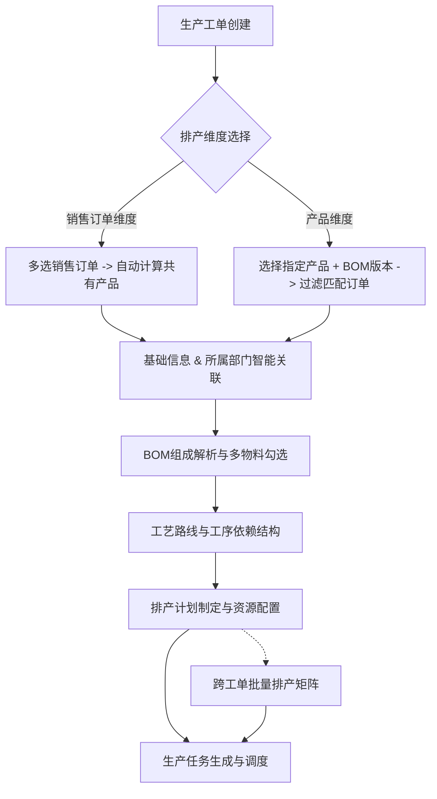

# 制造执行系统（MES）生产工单与多维排产调度平台 PRD 产品需求文档

---

## 1. 文档概述

| 文档版本 | 发布日期 | 文档状态 | 编写人 | 适用范围 |
| :--- | :--- | :--- | :--- | :--- |
| **V1.0** | 2026-08-28 | 正式发布 | MES产品团队 | 生产管理、计划调度、车间执行、系统研发 |

### 1.1 业务背景
在离散制造与多品种小批量生产场景下，企业常面临订单碎片化、物料层级复杂、工序繁多以及设备人员调配不均的问题。为解决传统单工单单线排产效率低、多订单相同品类重复换线等痛点，本系统提供了从**工单创建、多维订单归集、BOM/工艺路线关联、工序依赖解析、协同排产计划至生产任务下发与拆分**的全链路数字化排产调度方案。

---

## 2. 核心业务流程与功能架构

---

## 3. 详细功能需求说明

---

### 功能模块一：多维销售订单归集与排产维度切换

#### 1. 业务目标
支持销售订单与生产工单之间灵活的“一对多”、“多对一”映射归集，既满足按客户订单批次生产，又支持按同类产品归集合并生产。

#### 2. 详细需求

| 维度模式 | 交互与逻辑规则 | 适用场景 |
| :--- | :--- | :--- |
| **销售订单维度** | 1. 用户可多选多个销售订单（支持订单号、客户名称模糊搜索）； 2. 系统自动计算并提取所选订单中的**共有产品交集**； 3. 自动计算各订单对应的产品订购量总和，并在工单中展示订购拆分明细（客户、订购数、交期）。 | 针对同一大客户或关联批次项目，将多个同批订单集中排产。 |
| **产品维度** | 1. 用户先选择具体的目标产品（如智能终端、网关等）与指定的 **BOM 版本**（如 V2.1）； 2. **销售订单智能过滤**：下拉框动态联动，仅展示**包含该产品且 BOM 版本完全一致**的有效销售订单； 3. 用户勾选订单后，系统自动累计各订单需求量，生成跨订单生产需求明细。 | 针对爆款或通用产品，汇总全渠道碎片化订单进行规模化大批量生产，减少换模换线损耗。 |

---

### 功能模块二：所属部门（生产车间/事业部）管理与智能推导

#### 1. 业务目标
明确工单的生产执行主体与组织权属，支持车间级资源隔离与精细化管理。

#### 2. 核心功能点
1. **组织架构预设**：
   - 电子装配一厂（SMT贴片、PCBA测试、整机组装）
   - 智能装备制造部（自动化机械、送板机、精密滑轨）
   - 钣金冲压车间（激光下料、数控折弯、冲压成型）
   - 精密机加中心（CNC五轴加工、精密铣削）
   - 汽车电子事业部（车规级中控屏、车载无线充模组）
2. **智能推导规则**：
   - 当用户在工单中选定产品后，系统根据产品的物料分类（如自动化装备、通信设备、汽车电子）自动推荐并回填最匹配的所属部门；
   - 支持计划员手动覆写调整所属部门，切换后自动联动后续工作站与人员的可选范围。

---

### 功能模块三：工艺路线与工序依赖结构

#### 1. 业务目标
清晰定义物料加工的流转次序与依赖层级，严格控制前后道工序的物理约束（如：前道工序未完成，后道工序不可开工），并支持同层级工序并行作业。

#### 2. 核心功能点
1. **工序依赖结构与多级工艺路线**：
   - 支持产品主件、自制件、半成品独立配置工序依赖结构；
   - 界面提供直观的可选工序池与多层级工序块容器，支持跨层级双向拖拽调整；
2. **层级流转与依赖关系**：
   - 同一工序块内支持多工序**并行加工**；
   - 块与块之间支持定义前后置时序约束类型：**完成-开始（FS）**、**开始-开始（SS）**、**完成-完成（FF）**、**开始-完成（SF）**；
   - 具备前道质检必须合格的强卡控逻辑；
3. **甘特/时序冲突预警**：
   - 当计划员在排产面板中调整某道工序的计划时间时，若与前置依赖结构发生时间倒挂或重叠，系统实时给出警示标记，防止排产逻辑错误。

---

### 功能模块四：排产计划面板与生产任务生命周期

#### 1. 排产计划面板（单工单调度）
- **左侧排产计划树（BOM分类过滤）**：
  - 支持按**物料分类**（全部、成品、半成品、钣金件、机加件、自制件、采购件）快速过滤筛选；
  - 支持树形展开与多选复选框联动，可单选某节点，也可多选批量排产；
- **排产编辑区**：
  - **扁平视图**：按工序顺序平铺展示，配置每道工序的计划开始/结束时间、分配工作站、主操人员、设备及质检方案；
  - **工序聚合视图**：将相同工序名称跨物料合并展示，支持一处修改批量同步应用到多个物料工序；
- **批量生成任务**：勾选待排产工序后，一键生成对应的生产任务卡片。

#### 2. 生产任务管理面板（Task Management）
- **状态流转机制**：
  - **待下发（UNISSUED）** $\rightarrow$ **已下发/执行中（DISPATCHED）** $\rightarrow$ **生产中（IN_PROGRESS）** $\rightarrow$ **已完工（COMPLETED）**；
- **下发与取消控制**：
  - 支持单条任务快速「**下发**」与「**删除**」，支持多选「**批量下发**」；
  - 已下发任务支持「**取消**」（退回至待排产池重新调整计划时间或人员）；
- **任务拆分（Task Splitting）**：
  - 针对大批量工序任务，支持按数量拆分为多个子任务批次（Batch-A、Batch-B），分别指派不同班组或机台并行作业。

---

### 功能模块五：跨工单批量排产（Batch Scheduling）

#### 1. 业务目标
突破单工单边界，支持在工单列表中多选多个处于待排产状态的工单，进入统一的批量排产协同矩阵。

#### 2. 核心功能点
1. **多维度排产计划视图（Tab 快捷切换）**：
   - **工序聚合视图**：按工序名称归集跨工单批次，同一工序支持一键统一配置工作站、设备、岗位、操作工及报工类型，并可展开对各个工单行项进行微调；
   - **工单视图**：以生产工单为核心维度平铺展开各个工单，支持工单搜索、优先级过滤，工单卡片头部提供「工单统一配置」，下方展示工单的各道工序明细与状态；
   - **双向数据实时联动**：在任意视图下的勾选、参数变更、任务拆分均实时双向同步，数据 100% 保持一致。
2. **统一调度配置与智能推荐**：
   - 支持一键「智能推荐分配」，根据工序工艺特征自动匹配最适工作站、高精数控机台及责任员工；
   - 支持自定义业务字段展示（销售订单、客户、规格、图号、车间、部门等只读列）。
3. **批量任务生成与生命周期管理**：
   - 排产确认后一键为各个工单批量生成并同步生产任务；
   - 生产任务汇总表中提供直观、无遮挡的操作按钮（批量下发、取消、删除、任务拆分），支持随时撤回与调整。

---

## 4. 界面交互与非功能性要求

1. **响应式与操作防遮挡**：
   - 任务列表与排产表格在右侧固定操作列，采用内嵌式操作胶囊按钮，避免由于表格容器裁切导致的下拉菜单不可见问题；
   - 拆分弹窗、字段配置浮层采用全屏最高层级（`z-index: 99999`）并支持遮罩层居中展示。
2. **数据一致性与状态持久化**：
   - 排产维度、所属部门、选定产品及 BOM 版本等设置通过状态机及本地缓存持久保持，保证多步骤来回切换时数据不丢失。
3. **可扩展性**：
   - 预留未来与 ERP 系统的销售订单对接接口，以及与 WMS、MES 车间现场看板的数据推送接口。
